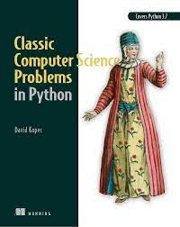
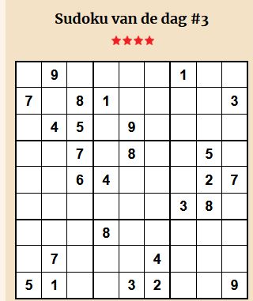
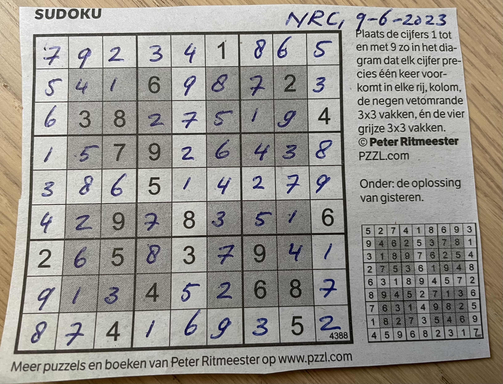

# sudoku-solver

This repository is for building a Dockerized API that is able to solve Sudoku puzzles.

## Sudoku
A sudoku puzzle consists of a grid of 9x9 cells; you can also consider the grid to be built from 9 'blocks' each measure 3x3 cells: three of these blocks are combined on every line and three lines constitute the entire grid.
Every row, column and block consists of 9 cells: every number from 1 to 9 must occur only once in every row, column and block.

There exist diffent types of Sudokus as well, e.g. the Sudoku that is published in NRC is subject to an additional restriction, by requiring that in each (consecutive) block formed by the rows and columns 2,3,4,6,7 and 8 the same restriction applies that each number must occur exactly once inside this block.

## Solving Sudokus
This is a search problem of the type CSP, Constraint Satisfaction Problem; it uses the CSP framework described in "[Classic Computer Science Problems in Python](https://www.manning.com/books/classic-computer-science-problems-in-python)" by David Kopec (Manning, 2019). The actual chapter on CSPs has been published as a free article on  [Manning website](https://freecontent.manning.com/constraint-satisfaction-problems-in-python/), the idea that Sudoku puzzles can be solved using the CSP framework is a suggested exercise.
The original code for the CSP framework has been taken from David Kopec's GitHub repository [Classic Computer Science Problems in Python](https://github.com/davecom/ClassicComputerScienceProblemsInPython).



## Dependencies
The program was implemented as a self-contained dockerized REST API, running Python 3.11 using the [FastAPI framework](https://fastapi.tiangolo.com/).


## Endpoints
The program supports two different endpoints which are document in the FastAPI documentation endpoints at [doc](/doc) and [redoc](/redoc).

Het invoerbestand moet 9 regels bevatten, waarbij op iedere rij 9 waarden voorkomen die de opgegeven startsituatie weergeven: een cijfer of een spatie (voor een onbekende waarde). Zo wordt de onderstaande sudoku:



weergegeven als:

```
 ,9, , , , ,1, ,
7, ,8,1, , , , ,3
 ,4,5, ,9, , , ,
 , ,7, ,8, , ,5,
 , ,6,4, , , ,2,7
 , , , , , ,3,8,
 , , ,8, , , , ,
 ,7, , , ,4, , ,
5,1, , ,3,2, , ,9

```

## Gebruik

Het programma wordt gestart vanaf de commando prompt met een verplichte bestandsnaam. Hierbij kan (optioneel) worden aangegeven dat er extra restricties van toepassing zijn middels de --mode parameter. Op dit moment wordt alleen de mode 'nrc' ondersteund. Misschien is hier wel een betere naam voor, voor dit soort sudoku's ...

```
python sudoku_solver.py --filename <naam-invoer-bestand> [--mode nrc]
```

### NRC Sudoku

Voorbeeld:


Het oplossen van deze sudoku puzzel kost iets meer tijd dan de reguliere sudoku puzzels, omdat er meer constraints aanwezig zijn. Desalniettemin wordt binnen een seconde de (of in ieder geval een) oplossing gegenereerd:


